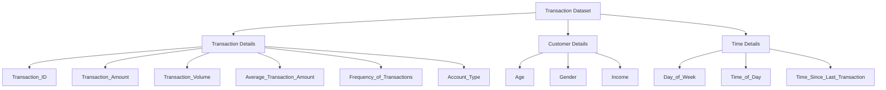

# Financial-Transaction-Anomaly-Detection-using-Machine-Learning

  

# 💳 Financial Transaction Anomaly Detection Using Machine Learning

> **An end-to-end unsupervised machine learning project that detects anomalous financial transactions using Isolation Forest and Autoencoder Neural Networks.**

---

# 📖 Project Overview

Financial fraud continues to evolve with the rapid growth of digital transactions, making traditional rule-based detection methods increasingly ineffective. This project presents an **unsupervised machine learning framework** for identifying anomalous financial transactions without relying on labeled fraud data.

Two anomaly detection techniques—**Isolation Forest** and **Autoencoder Neural Network**—were implemented and compared to detect suspicious transaction patterns. The project demonstrates how machine learning can assist financial institutions in identifying potential fraud, minimizing financial risk, and strengthening fraud monitoring systems.

---
## 📊 About the Dataset

This dataset contains **1,000 financial transaction records** with **12 features** describing transaction behavior, customer demographics, and account information. It is designed for **transaction analysis, anomaly detection, fraud detection, and exploratory data analysis (EDA)** using machine learning and data visualization techniques.

The dataset combines transactional, temporal, and customer-related attributes, making it suitable for identifying unusual transaction patterns and building predictive analytics models.

| Column Name | Description |
|-------------|-------------|
| **Transaction_ID** | Unique identifier assigned to each transaction. |
| **Transaction_Amount** | Monetary value of the transaction. |
| **Transaction_Volume** | Number or volume of transactions associated with the customer or account. |
| **Average_Transaction_Amount** | Average transaction amount for the customer over a period of time. |
| **Frequency_of_Transactions** | Number of transactions performed within a specific timeframe. |
| **Time_Since_Last_Transaction** | Time elapsed since the customer's previous transaction. |
| **Day_of_Week** | Day on which the transaction occurred. |
| **Time_of_Day** | Time period during which the transaction took place (Morning, Afternoon, Evening, or Night). |
| **Age** | Age of the customer. |
| **Gender** | Gender of the customer. |
| **Income** | Annual income of the customer. |
| **Account_Type** | Type of bank account associated with the transaction (e.g., Savings or Current). |
---
## 🗂 Dataset Schema

# 🎯 Business Problem

Financial institutions process thousands of transactions every day, making manual fraud detection both time-consuming and impractical. Since fraudulent transactions represent only a small fraction of all transactions and labeled fraud data is often unavailable, identifying suspicious activity becomes a challenging anomaly detection problem.

This project addresses this challenge by leveraging **unsupervised learning algorithms** to identify unusual transaction patterns and potential fraud without requiring predefined fraud labels.

---

# 🎯 Project Objectives

- Analyze transaction data and understand customer behavior.
- Perform Exploratory Data Analysis (EDA).
- Clean, preprocess, and transform the dataset.
- Detect anomalous transactions using Isolation Forest.
- Build an Autoencoder Neural Network for anomaly detection.
- Compare both models to evaluate their effectiveness.
- Generate actionable insights for real-world fraud detection.

---

# 🛠️ Tech Stack

| Category | Technologies |
|----------|--------------|
| Programming | Python |
| Data Analysis | Pandas, NumPy |
| Visualization | Matplotlib, Seaborn |
| Machine Learning | Scikit-learn |
| Deep Learning | TensorFlow, Keras |
| Development | Jupyter Notebook |

---

# 🔄 Methodology

This project follows a structured machine learning workflow to identify anomalous financial transactions using unsupervised learning techniques.

---

## 📌 1. Research Framework & Approach

A systematic framework was designed to solve the fraud detection problem, beginning with data exploration and progressing through preprocessing, anomaly detection, model comparison, and evaluation. The approach focuses on identifying suspicious transaction patterns without requiring labeled fraud data.

---

## 📊 2. Data Understanding & Exploration

The dataset was explored to understand its structure, feature distributions, and overall quality. Exploratory Data Analysis (EDA) was performed using descriptive statistics and visualizations to identify transaction trends, detect missing values, and uncover potential anomalies before model development.

---

## 🧹 3. Data Preprocessing & Transformation

The dataset was prepared for machine learning by handling missing values, standardizing numerical features, and transforming variables where required. Feature scaling ensured consistent input across models and improved anomaly detection performance.

---

## 🤖 4. Machine Learning Modeling

Two unsupervised anomaly detection models were implemented:

- **Isolation Forest** – Detects anomalies by isolating unusual observations through random partitioning.
- **Autoencoder Neural Network** – Learns normal transaction behavior and identifies anomalies based on reconstruction error.

Using both approaches enabled a comprehensive comparison between traditional machine learning and deep learning techniques.

---

## 🚨 5. Anomaly Detection & Interpretation

Anomaly scores produced by both models were analyzed using statistical thresholds to classify suspicious transactions. Visualizations and score distributions were used to interpret abnormal transaction behavior and validate model predictions.

---

## 📈 6. Model Evaluation

Since the dataset contained no labeled fraud records, model performance was evaluated using anomaly score distributions, statistical thresholds, and visual analysis instead of traditional classification metrics. Comparing the outputs of both models helped assess their consistency and reliability in detecting anomalous transactions.

## Model Comparison

To evaluate the effectiveness of both anomaly detection techniques, the results of the Isolation Forest and Autoencoder models were compared.

| Model | Mean | Standard Deviation | Threshold | Total Anomalies |
|-------|------:|-------------------:|----------:|----------------:|
| Isolation Forest | 0.462 | 0.058 | 0.5776 | 45 |
| Autoencoder | 719,290 | 374,665 | 1,468,620 | 20 |

### Interpretation

The Isolation Forest model identified **45 anomalous transactions**, whereas the Autoencoder detected **20 highly suspicious transactions**.

This difference is expected because both models detect anomalies using different approaches:

- **Isolation Forest** isolates observations that are different from the majority of the dataset. As a result, it detects a larger number of potential anomalies, including both moderate and extreme outliers.

- **Autoencoder** learns the normal transaction patterns during training. Transactions with high reconstruction error are considered anomalies, making it more selective and focused on the most unusual transactions.

Interestingly, the anomalies detected by the Autoencoder were also present among those identified by the Isolation Forest. This indicates that the Autoencoder primarily captured the most critical anomalies, while the Isolation Forest identified a broader range of suspicious transactions.

### Conclusion

Both models performed well for unsupervised fraud detection, but they serve slightly different purposes:

- **Isolation Forest** is suitable when the goal is to identify a wider set of suspicious transactions for further investigation.
- **Autoencoder** is more conservative and effective at identifying the most significant anomalies with higher confidence.

Using both models together provides a more comprehensive fraud detection strategy, where Isolation Forest offers broader coverage and the Autoencoder helps prioritize the most critical cases.

---

# 🏁 Conclusion

As the dataset did not contain labeled fraud records, this project adopted an **unsupervised learning approach** by implementing **Isolation Forest** and **Autoencoder Neural Networks** to identify suspicious financial transactions.

Instead of relying on traditional classification metrics, both models were evaluated using **anomaly scores, statistical thresholds, and visualization techniques**. The results demonstrated that **Isolation Forest** detected a broader range of anomalous transactions, while the **Autoencoder** focused on the most significant deviations. The overlap between their predictions strengthened confidence in the robustness and reliability of the proposed anomaly detection framework.

Overall, this project highlights the importance of **data exploration, preprocessing, feature scaling, and model comparison** in building an effective fraud detection system. The framework provides a practical approach for identifying potential financial risks and can support organizations in improving fraud monitoring and early risk detection.

---

# 👩‍💻 Author

**Aishwarya**

*M.Sc. Data Science*

📌 **Skills Demonstrated:** Python • Pandas • NumPy • Data Cleaning • Exploratory Data Analysis • Data Visualization • Feature Engineering • Scikit-learn • TensorFlow • Keras • Isolation Forest • Autoencoder • Anomaly Detection • Machine Learning

> **An end-to-end unsupervised machine learning project that detects anomalous financial transactions using Isolation Forest and Autoencoder Neural Networks.**

